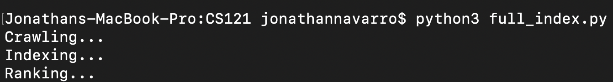
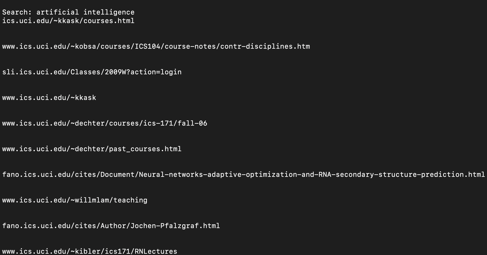
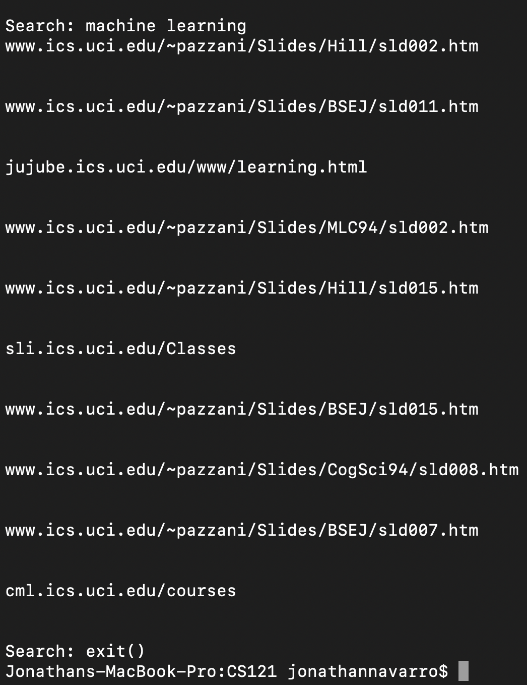
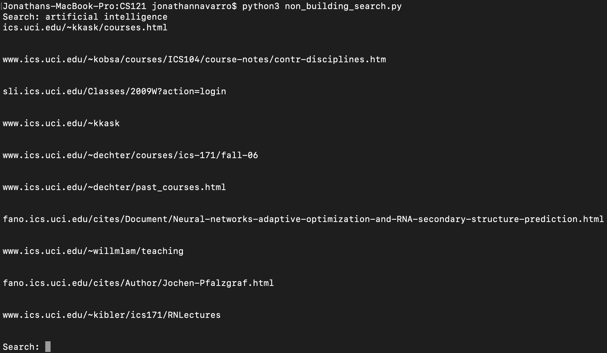

# UCISearch
A Search Engine I built based around UCI based websites 

Given a large set of webpages that belong to the UCI domain, the crawler parses the webpage for more links and adds them
to the webpages to be parsed.  The ranking scheme that the index uses is TF-IDF or Term Frequency - Inverse Document Frequency.
The tf–idf value increases proportionally to the number of times a word appears in the document and is offset by the number of 
documents in the corpus that contain the word, which helps to adjust for the fact that some words appear more frequently in 
general. 

Once all of the webpages have been crawled and indexed, the user is then able to make queries. After each query is made, the
top 10 most relevant URLs according to their rank are returned for the user to see. The user also has the option to use the
non building search file to restart the search engine once the index has already been built. 

This is what the program execution looks like when you build the index before issuing queries. 

This is what the program execution looks like when you have already run full_index.py and have a completed index. 

